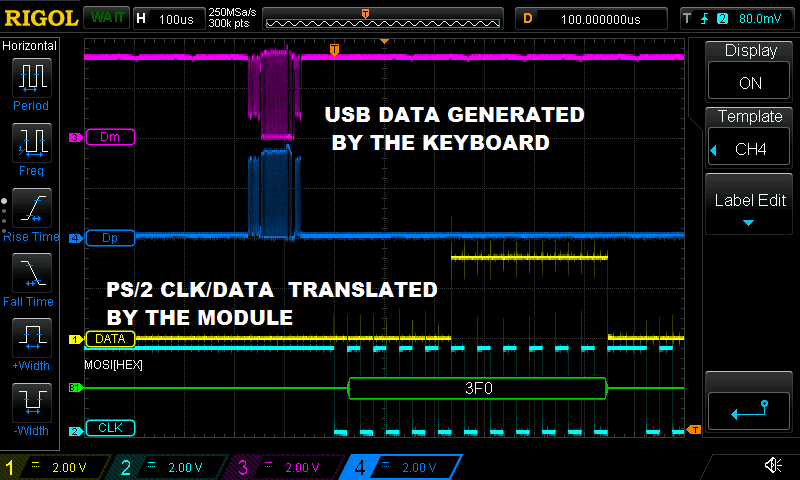

## USBKeyboard
Interfaz directa con teclados USB y conversión a PS/2.  
Todos los módulos requieren un entrada de reloj de 48MHz.  

Ahora mismo sólo soportan teclados que funcionen a 1.5Mbps (low speed devices),  
si es posible, se irá añadiendo soporte para teclados full speed.

## Tres opciones:
- USB_L1: el más básico y que menos LEs consume. Teclado USB directo y comunicación con el top mediante registros.  
- USB_L2: L1 + control del estado de los LEDs del teclado.   
- USB_PS2: conversión directa de USB a PS/2 para aprovechar cores retro sin apenas modificarlos.  
   Para ello, el módulo se conecta a las líneas USB y, como salida, genera las señales PS/2.  
   Este módulo tiene 3 entradas para controlar el estado de los leds del teclado USB, si no van a usarse, deben conectarse a 0 lógico.
   Requiere el archivo USB_PS2_CONVERSION.txt.

.

